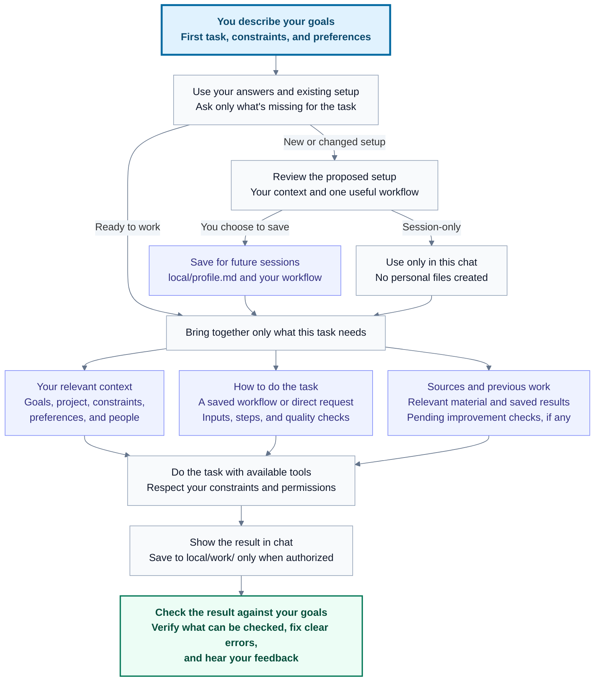
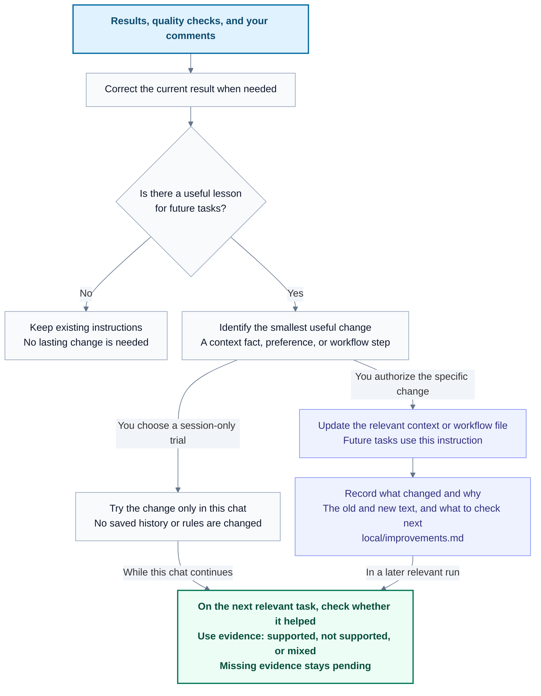

# tiny brain

tiny brain gives your AI assistant a set of Markdown files for your goals, preferences, repeatable tasks, and saved work.

Choose a quick start with a task, or a guided introduction so the assistant can get to know you first. Both lead to a short profile and workflow you can review before saving. You use these files through Codex, Claude Code, or Cursor.

## Try it before setup

Open this repository's folder in your AI tool and type `/demo`, or say "tiny brain demo". Choose how you want to try it:

| Mode | What you get |
| --- | --- |
| `/demo show` | A short fictional walkthrough, showing the user's input, proposed setup, sample result, and how to resume or revise it. Useful for showing someone what tiny brain does. |
| `/demo test` | A fresh interactive onboarding session. You answer as a new user, so you can try different goals, skip questions, correct the draft, and find confusing steps. |

Both follow the repository's current instructions. The assistant labels replies `Demo: show` or `Demo: test` and keeps the practice setup in chat. "Save", "remember", and "run" simulate the corresponding steps. It can show sample results, but it does not change files, run code or external actions, browse the web, use connected services, commit, or push. It ignores your existing personal setup.

### Test onboarding, step by step

Send each command or answer as a separate message in the **same chat**:

1. Send `/demo test`. This starts onboarding immediately; you do not need to send `/demo` or `/start` first.
2. Choose Quick, Guided, or See an example, unless you already supplied a task. Use clickable choices when your tool offers them, or answer in ordinary messages. Skip an optional detail or correct the proposed setup as a new user would.
3. When a setup is proposed, you can say "Save this setup" and then "Run my first workflow" to try the rest of the experience. Both remain simulated. You can also choose session-only use.
4. Send `/demo review` whenever you want feedback, even halfway through onboarding. It reviews what happened so far and suggests improvements in chat.
5. After the review, reply normally to continue the same attempt, use `/demo reset` to try again from scratch, or use `/demo exit` to finish.

Review is optional and does not end or reset the demo. Review before resetting or exiting if you want feedback on that attempt. Do not send `/demo test` again just to continue: it starts a fresh attempt.

### Show it to someone

Send `/demo show` for the short walkthrough. You can then send `/demo review` to discuss it, `/demo test` to let the viewer try onboarding from scratch, or `/demo exit` to finish. You do not need to use every command in order. `/demo` on its own is just a menu for choosing show or test.

Leaving demo does not save the practice setup or start real work. To begin real setup afterward, say "Start tiny brain".

If your tool intercepts slash commands, say "tiny brain demo test" or paste:

```text
Read AGENTS.md and commands/demo.md, then start demo test.
```

Demo is a conversational instruction, not a permission sandbox. The tool's controls still apply. Normal session-only setup can do real tasks without saving a profile; demo simulates file and external actions throughout.

## Start here

1. In Codex, create a local project with an empty folder on your computer, such as `tiny brain`.
2. Open a chat in that project.
3. Copy and paste this prompt into the chat:

```text
Set up tiny brain in this project using this repository:
https://github.com/williswee/tiny-brain

Read its README and copy the starter files, including .gitignore, into this folder. Preserve any existing work. Follow AGENTS.md and commands/start.md to help me set up tiny brain. In your first reply after verifying the copy, ask how I'd like to start: Quick: give me a task, Guided: get to know me, or See an example. Briefly explain each choice and tell me to reply with its number, label, or my own words. Don't stop at a file-copy report or a "ready" message. If I've already given you a task, chosen a route, or started a setup draft, continue with the next unanswered topic instead. Ask about one topic at a time and use answers I've already given. Show me the proposed personal setup before saving it.
```

You can use the same prompt in Claude Code or Cursor with an empty folder open and file access enabled.

For a fresh setup with no task or route supplied, the assistant's first reply after copying the files should ask how you'd like to start and show these choices:

| Choice | What happens |
| --- | --- |
| Quick: give me a task | Start with a note, draft, or something that's stuck, then review a small task and setup. If your request already includes a task, the assistant uses it. |
| Guided: get to know me | Share an optional introduction, then find one small task with the same help as Quick. Skip anything you've already answered. |
| See an example | See a short fictional example before choosing your own task or guided setup. |

The assistant asks about one topic at a time and reuses answers you already gave. Choose an option when clickable choices are available, or type your own answer. You can say "not sure", skip questions, correct the brief, or keep the setup only in this chat. No name or job is required.

If you already have the files, open their folder in your AI tool. If you downloaded a ZIP, extract it first. Then paste:

```text
Read AGENTS.md and follow commands/start.md to help me set up tiny brain. Ask the first unanswered question now, including the route choices if I haven't supplied a task or route and have no setup to resume.
```

Once the files are in place, you can also say "Start tiny brain". These are ordinary chat messages, so you do not need a slash command. If the assistant cannot retrieve the repository, download it from GitHub with **Code > Download ZIP** and follow the steps above.

See the [quickstart](tiny-brain-quickstart.md) for using a downloaded copy, your first session, and troubleshooting.

## What you get

- A profile with the goals, background, constraints, and preferences you choose to share.
- A workflow with steps and checks for a task you want to repeat.
- Saved work you can review and continue in a later session.
- Context and workflow changes based on your feedback, with a record you can inspect and use to undo them.
- Plain files you can edit, move, or back up yourself.

The starter needs no installer, plugin, API key, script, or integration. Your AI tool has its own account requirements and usage costs. It must be able to read project files and write the work you ask it to save.

## Recurring business use cases

Start with a business decision you make every week or month. Each run should use fresh data, apply your business rules, and check what happened to the actions from the previous run. Saved context and work let you do this without rebuilding the brief in every chat.

These are workflows you can build with the starter. The files below are examples to create when you choose a use case. They are not included business packages or assumptions about your business.

| Use case | Cadence | Decision each run supports | Business results to track |
| --- | --- | --- | --- |
| Sales pipeline review | Weekly | Which deals need attention, who owns the next step, and what changed since last week? | Missed follow-ups, deals advancing to the next stage, and the value of won deals. |
| Customer renewal review | Weekly for upcoming renewals, monthly for the wider account base | Which customers need an intervention before renewal, and did earlier actions help? | Unresolved renewal risks, completed interventions, and renewal outcomes. |
| Marketing experiment review | Weekly, with an agreed measurement window | Which experiment has enough evidence to continue, change, or stop? | Cost per qualified lead, conversion to opportunities, and completed experiments. |
| Client delivery review | Weekly | Which projects need a scope, staffing, or deadline decision? | Unapproved scope hours, overdue milestones, rework, and margin against plan. |
| Inventory and replenishment review | Weekly, or more often for fast-moving stock | Which products may run out or remain unsold, and what needs a purchasing decision? | Stockout days, ageing inventory, and forecast errors. |

### What to save for repeat use

Keep the first setup small. A profile and `local/workflows/first-task.md` can hold the initial instructions. Split out the files below when you need more detail or want to reuse a method across workflows.

| File type | What it holds | How the next run uses it |
| --- | --- | --- |
| `local/profile.md` and linked `local/context/*.md` files | Business goals, definitions, responsibilities, and limits. | Uses the same meaning of a qualified lead, an at-risk renewal, or an overdue milestone. |
| `local/skills/<name>/SKILL.md` | A reusable method with required inputs, steps, an output format, and quality checks. | Applies the same review method without asking you to explain it again. |
| `local/workflows/<name>.md` | The review cadence, context and skill files to read, current inputs, previous results to compare, and save policy. | Tells the assistant how to run the whole review and which prior actions to revisit. |
| `local/inputs/<review-date>/` | Dated exports and notes you provide for this run. | Keeps current evidence separate from business rules and old data. |
| `local/work/<workflow>/<review-date>.md` | The review, source dates, proposed and agreed actions, owners, due dates, and reported outcomes. | Checks the same deals, accounts, campaigns, projects, or products against the previous review. |

These skill files are ordinary Markdown instructions. The workflow must tell the assistant to read them by path. Putting `SKILL.md` under `local/skills/` does not install a native skill, connect a service, or schedule a run. A short method can stay in the workflow until a separate skill file is useful.

The examples below use manual exports and user-started reviews. Each workflow can include permission to save its dated reviews under `local/work/`. Sending messages, changing campaigns, or placing orders needs separate authorization. Scheduling and service connections are optional additions.

<details>
<summary>Sales pipeline review: turn deal history into a weekly action list</summary>

Supply a current export from your sales system with deal IDs, stages, values, owners, activity dates, and next steps. Include call notes when they explain a change.

| Example file | What to put in it |
| --- | --- |
| `local/context/goals.md` | Your sales target and period, what counts as a qualified deal, and how you measure progress. |
| `local/context/project.md` | Your offer, customer fit, sales stages, and evidence required to move a deal between stages. |
| `local/context/constraints.md` | Stage-specific inactivity limits, discount authority, and what evidence a forecast needs. |
| `local/skills/pipeline-review/SKILL.md` | Match deals by ID, compare changes, flag missing next steps, and rank follow-ups using your criteria. Cite source rows and distinguish missing data from lost deals. |
| `local/workflows/weekly-pipeline.md` | Read the context and skill above, this week's export, and the previous pipeline review. Produce a deal-change table, unresolved actions, and proposed next steps. |

On the next run, check which follow-ups happened and whether those deals progressed. Keep an unresolved action visible until evidence shows it is complete or you decide to close it. Record the outcome before proposing another action.

For example, a fictional business might save these stage definitions in `local/context/project.md`. Use your own definitions when setting up the files:

```markdown
## Sales stages

- Qualified: the buyer has confirmed a need and named a decision owner.
- Proposal: we have shared a scope and price with the buyer.
- Procurement: the buyer is reviewing the proposed commercial terms.
```

Its `local/skills/pipeline-review/SKILL.md` could contain this method:

```markdown
# Pipeline review method

## Inputs

Use the current and previous dated exports, the previous review's open actions,
and the stage definitions and inactivity limits in the linked context files.
On the first run, establish a baseline without inventing a previous period.

## Steps

1. Check for missing or duplicate deal IDs and report gaps in the input.
2. Compare stage, value, activity, and next-step changes for matching deals.
3. Check each prior action against the new data or an update from its owner.
   Label it completed, overdue, still open, or unverified, and cite the evidence.
4. Apply the saved business rules to rank follow-ups. Do not invent thresholds.
5. Return a deal-change table and proposed actions with owners and due dates.
   Keep proposed actions separate from commitments the user has accepted.

## Quality check

Reference the source rows for each finding. Treat a missing deal or missing
activity as unknown until checked. Do not infer a lost deal from an absent row.
```

Example recurring request:

> Read local/workflows/weekly-pipeline.md and run this week's review using the new export. Compare it with the previous saved review and check the open actions before proposing new ones.

</details>

<details>
<summary>Customer renewal review: track account risks and the response to them</summary>

Supply the renewal calendar, dated usage summaries, support issues, and account notes. Keep stable account IDs so the assistant can compare the same customers across reviews.

| Example file | What to put in it |
| --- | --- |
| `local/context/goals.md` | Your retention objective, review period, and customer outcomes that indicate value. |
| `local/context/project.md` | Service tiers, customer lifecycle, and the evidence your team uses to assess account health. |
| `local/context/constraints.md` | Renewal notice deadlines, escalation rules, and who can approve concessions. |
| `local/skills/renewal-review/SKILL.md` | Compare usage, unresolved issues, and account notes against your criteria. Separate confirmed concerns, hypotheses, and missing information. Check prior interventions against reported customer responses. |
| `local/workflows/renewal-review.md` | Read the context and skill above, current account data, and the last review. Produce an intervention list with owners and dates, plus outreach drafts for review. |

On later runs, check whether the owner acted, whether the customer responded, and whether the risk remains. A missing usage export is unknown evidence, not proof that the customer has stopped using the product. Reconcile earlier risk assessments with actual renewal outcomes when those become available.

</details>

<details>
<summary>Marketing experiment review: connect campaign decisions to measured results</summary>

Supply campaign spend, conversion data, lead-quality feedback, and the previous experiment's hypothesis. Use consistent campaign IDs and record the date range and attribution window of each export.

| Example file | What to put in it |
| --- | --- |
| `local/context/goals.md` | The outcome you want, such as qualified opportunities, and the agreed calculation for each metric. |
| `local/context/project.md` | Audience, offer, conversion events, and how leads qualify and become opportunities. |
| `local/context/constraints.md` | Budget limits, approved claims, attribution rules, and the evidence required before changing a campaign. |
| `local/skills/campaign-review/SKILL.md` | Compare compatible periods, calculate agreed metrics, flag small samples and delayed conversions, and check the previous experiment against its original criterion. |
| `local/workflows/weekly-marketing.md` | Read the context and skill above, current exports, and the previous review. Report results and propose whether to continue, change, or stop the experiment. Draft the next test only after reviewing the current one. |

Keep inconclusive tests open rather than declaring a winner each week. Carry the hypothesis, start date, success criterion, and result into the saved review so later runs can evaluate the same test. Changes in revenue or conversion alone do not establish what caused them.

</details>

<details>
<summary>Client delivery review: catch scope and delivery problems before the next milestone</summary>

Supply current project updates, time records, approved budgets, and scope changes. This suits an agency, consultancy, or other business delivering work for clients.

| Example file | What to put in it |
| --- | --- |
| `local/context/goals.md` | Delivery and margin targets, with an agreed definition of on-time delivery and margin. |
| `local/context/project.md` | Approved deliverables, milestone dates, acceptance criteria, and client decisions. |
| `local/context/constraints.md` | Team capacity, approved hours and costs, and the process for accepting a scope change. |
| `local/skills/delivery-review/SKILL.md` | Compare actual hours and costs with the approved plan. Flag scope changes, dependencies, and milestone risks. Separate actual margin from forecasts and show missing inputs. |
| `local/workflows/weekly-delivery.md` | Read the context and skill above, current project records, and last week's commitments. Produce proposed recovery actions with owners, decision deadlines, and client update drafts. |

On the next run, check which commitments were met and whether the estimate changed. Preserve the original plan so a revised deadline does not erase a missed milestone. Confirm new scope before treating it as approved work.

</details>

<details>
<summary>Inventory review: compare purchasing decisions with stock and demand</summary>

Supply dated stock, sales, returns, and open purchase-order exports using consistent product IDs. Keep available, reserved, and incoming stock distinct.

| Example file | What to put in it |
| --- | --- |
| `local/context/goals.md` | Stock availability and inventory holding targets, with the periods used to measure them. |
| `local/context/project.md` | Product definitions, stock-status meanings, and known promotions or seasonal demand patterns. |
| `local/context/constraints.md` | Supplier lead times, minimum order quantities, purchasing limits, and who approves an order. |
| `local/skills/inventory-review/SKILL.md` | Reconcile stock by product ID, apply your agreed demand-estimation method, account for incoming orders, and flag stockout or excess-stock risks. Show forecast assumptions and missing data. Account for stockout periods, when recorded sales may understate demand. |
| `local/workflows/weekly-inventory.md` | Read the context and skill above, current exports, and previous recommendations and decisions. Produce a purchasing review with proposed quantities and the evidence for each. |

On later runs, compare projected demand with actual sales and check whether approved orders arrived. Separate a recommendation from an order you actually placed. Avoid proposing a second order for stock already on its way. The review prepares purchasing decisions; it does not place orders.

</details>

### What changes between the first and fourth run

Consider a fictional weekly sales review. These details illustrate the process and are not default sales rules.

| Run | Evidence and saved work | What becomes useful next time |
| --- | --- | --- |
| First | You define the sales stages and follow-up rules. Deal `D-104` has no agreed next step. You assign an owner and due date in the saved review. | The next run has a specific commitment to check. |
| Second | A new export and the owner's notes show a meeting is booked for `D-104`. Deal `D-208` still has no next step. | The review closes the completed action with evidence and carries the unresolved one forward. A deal absent from an export stays unknown until checked. |
| Third | You explain that deals waiting on procurement need a different inactivity threshold. The assistant proposes an edit to `local/context/constraints.md` for your approval and records the saved change in `local/improvements.md`. | The next run has an agreed check for whether that rule reduces false alerts without hiding missed follow-ups. |
| Fourth | The assistant checks the revised rule against the new export and your review of the flagged deals. It reports supporting evidence, a failed check, mixed results, or missing evidence. | You can keep, revise, or undo the rule based on what happened. The saved review also records how much preparation and correction the run needed. |

Compare this with your current ChatGPT or manual process. If that process already preserves the same context, methods, and action history, check whether tiny brain reduces the effort to maintain and use them.

### Measure whether it helps

Before the first run, record the time and corrections your current process takes. Choose a comparable scope and a quality check, such as "every open deal has a supported next-step status". Then run the workflow across four review cycles.

| Measure | What to record after each run |
| --- | --- |
| Total effort | Time spent preparing inputs, prompting, checking, and correcting the review. Count the initial setup time separately so it stays visible. |
| Reliability | Wrong calculations, unsupported conclusions, missing records, and false alerts. |
| Follow-through | Actions due, completed, overdue, or still unverified. Record the source of each status. |
| Business outcome | The relevant measure from the use-case table, with the same definition and reporting window each time. Note other changes that could affect it. |

Useful evidence is less total work at acceptable quality, fewer missed commitments, or better decisions you can trace to the review. A polished report or repeated usage alone does not prove value. Revenue and retention may take longer to observe than four cycles, and a change in either does not prove that tiny brain caused it.

To build one of these workflows, paste:

```text
Help me set up the weekly sales pipeline review described in README.md. Reuse my existing context and ask for the business rules and inputs you still need. Draft the context, workflow, and any useful skill file for my review. Make the workflow read those files and the previous review explicitly. Include a save policy and a check on the prior run's actions. Help me record a baseline so we can assess the first four runs.
```

Replace "weekly sales pipeline review" with the use case you choose. Start with one workflow and save only the files you agree to use.

## What the assistant asks you

Quick starts with something you have or one thing that's stuck. Guided adds an optional introduction first. A few words or a rough paste are enough to begin. The assistant asks one short question at a time, reuses what you've said, and stops asking once it can give a useful first pass in chat. You can review a reusable setup afterward; saving is optional.

| Topic | Example question | What the assistant needs to know |
| --- | --- | --- |
| About you, in Guided | "What should I call you, and what do you do? Your name is optional." | Relevant background you choose to share. You can skip the introduction. |
| First small task | "What do you have right now?" Choose something to work on, something stuck, or a fictional example. | One concrete item or situation. Paste it, describe it in a few words, or use your own answer. A task already supplied skips this question. |
| Result, only if unclear | "Would a short summary or an action list help more?" | The smallest useful output for your item. Choices adapt to what you supplied. |
| Context or limits, only if needed | "Who will read this message?" | Only a detail that would change the result. Other preferences can wait for the editable preview. |

These are possible questions, not a questionnaire or fixed number of steps. You can start without all the answers and add details as you work. Before saving, the assistant reflects your chosen task and result in a brief you can correct. Suggestions stay separate from your stated preferences. The assistant should never assume your industry, country, job, or personal circumstances.

## How it works

Read from top to bottom. Review a setup when you first start or need to change it.
If your existing setup fits the task, the assistant can use it and begin work.

After analysis, the assistant should recommend a useful next move, briefly explain
why, and provide a small draft or first step when the context supports it. It
asks a targeted question only when a missing fact or a decision you own matters.
Suggestions stay within your request and do not grant permission to send, save,
or take other actions. You can ask for analysis only or stop; a completed answer
does not need extra tasks attached to it.



Context records your goals, preferences, and relevant facts. A workflow lists the steps and checks for a task. Sources and previous work help the assistant check claims and continue unfinished work. It reads the files relevant to your request and can work without the optional context files.

You choose whether to save the setup, a task's output, or a change for future tasks.
The assistant should not ask you to approve something you have already authorized.

## How it improves over time

The assistant can use results and your feedback to change a context file or workflow. For example, if a plan misses a deadline, you can ask it to add a deadline check to that workflow. This changes the instructions it reads on future tasks. It does not retrain the AI model.

The diagram shows how the assistant decides what to change and checks whether the
change helped on a later task.



"Remember this" or "update this workflow" authorizes that specific change. For other lasting changes, the assistant proposes an edit for your approval. Permission to save a task's output does not authorize changes to its workflow.

| Your comment or result | How it can help |
| --- | --- |
| "This is too long. Make it shorter." | Revise this answer without assuming a permanent preference. |
| "Remember to start these reports with three key points." | Save that preference in the profile or existing preferences file, then use it for future reports. |
| "The plan missed the deadline. Add a deadline check to this workflow." | Update that workflow and check the next plan against its deadline. |
| "This task took twice as long as the plan allowed." | Review the estimate and propose an adjustment to try. One result is not enough to establish a general rule. |

Say "tiny brain improve" to review a recent result and your feedback. The assistant should explain when there is no useful change to make. Praise, silence, and the assistant's confidence do not prove that a workflow is better.

The context or workflow file holds the current instruction. The assistant records saved changes in `local/improvements.md`, along with their reasons and follow-up checks. You can ask it to revise or undo a specific change. If you keep the session in chat only, the assistant writes no feedback or history files unless you ask.

The assistant checks results while you work with it. You must report outcomes it cannot see, such as whether you finished a planned task, or connect a service that provides them. The starter does not monitor outcomes in the background.

## Your context files, explained

A context file is a note the assistant reads when it is relevant to your request. The first setup keeps your context in `local/profile.md`. The assistant drafts it for you.

You can later ask the assistant to move detailed topics into the optional files below. It creates them when you request them.

| Context file | What it means | When it is created |
| --- | --- | --- |
| `local/profile.md` | Your goals, first task, constraints, preferences, and relevant facts you want remembered. It links to any additional context files. | When you save your first setup. |
| `local/context/goals.md` | What you want to achieve, your priorities, and how you will recognize success. | Optional, when goals need more detail than the profile. |
| `local/context/project.md` | Your project's background, current stage, intended audience, and past decisions. For software work, this can include technical details. | Optional, when an ongoing project needs a shared brief. |
| `local/context/constraints.md` | Time limits, deadlines, available resources, required tools, and things to avoid. | Optional, when several tasks share these limits. |
| `local/context/preferences.md` | Your preferred tone, answer length, format, level of explanation, and way of working with the assistant. | Optional, when preferences need their own note. |
| `local/context/people.md` | Relevant roles, responsibilities, and collaborators. Include only information needed for the work. Real names are optional. | Optional, when coordination with others matters. |

When a topic moves to a separate file, the profile links to it. Keeping the details in one place avoids conflicting copies.

Other locations support your context:

| Path | Purpose |
| --- | --- |
| `local/workflows/first-task.md` | The inputs, steps, expected output, quality check, and save policy for your first task. The assistant creates it when you save setup. |
| `local/work/` | The plans, drafts, reviews, or other results you choose to save and return to. |
| `local/improvements.md` | A history of saved instruction changes, their reasons, and follow-up checks. The assistant creates it when you save a reusable improvement. It contains no full conversation transcript. |

## Where things live

| File or folder | Purpose |
| --- | --- |
| [AGENTS.md](AGENTS.md) | Short instructions for the assistant |
| [CLAUDE.md](CLAUDE.md) | Imports the same instructions for Claude Code |
| [commands/](commands/) | Setup, demo, help, status, and improvement procedures |
| [templates/](templates/) | Blank starting formats, with no sample user's profile |
| `local/` | Your profile, workflows, and work. Created when you save setup and ignored by Git |
| [tiny-brain-quickstart.md](tiny-brain-quickstart.md) | Beginner guide |
| [tiny-brain-blueprint.md](tiny-brain-blueprint.md) | Optional design reference for extending or rebuilding the system |
| [docs/review.md](docs/review.md) | Review of the original guides and remaining product decisions |
| [docs/acceptance.md](docs/acceptance.md) | Scenarios for checking the beginner experience |

## Your data

The assistant saves personal setup and output under `local/` by default. Git ignores that folder, but this does not encrypt or back it up. Your AI provider may process files the assistant reads according to your tool's settings. Keep passwords and API keys out of your profile. The starter collects no usage data and runs no background jobs.

To share a workflow, ask the assistant to make a separate copy with personal details removed. Review that copy before publishing it.

## Contributing and support

Ask questions or report problems in [GitHub Issues](https://github.com/williswee/tiny-brain/issues). See [CONTRIBUTING.md](CONTRIBUTING.md) for how to contribute without sharing personal context. The [compatibility notes](docs/compatibility.md) list the tools' file-loading conventions and which client tests remain pending.

## License

tiny brain is open source under the [MIT License](LICENSE). You can use, modify, and share it, including commercially, subject to the license terms.
